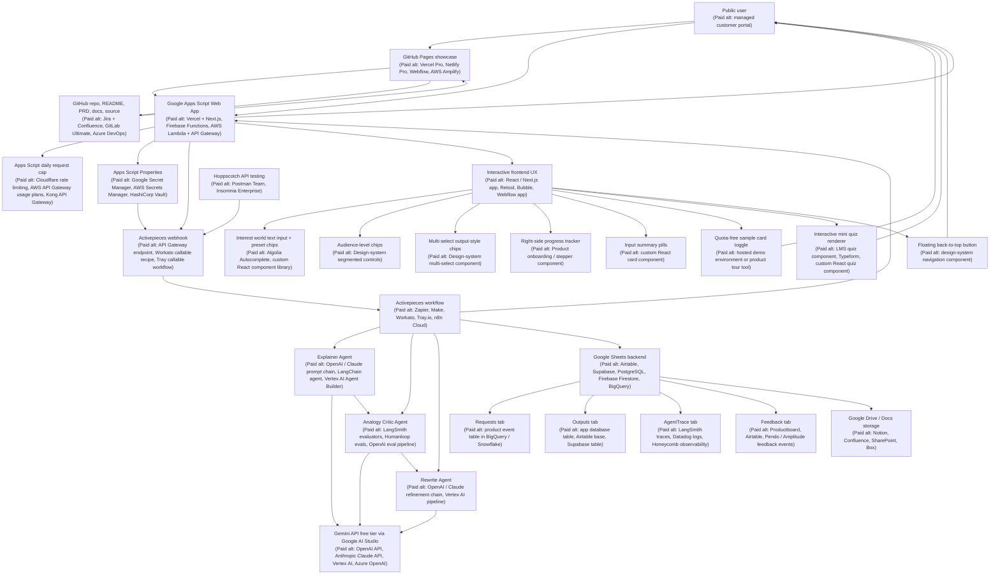
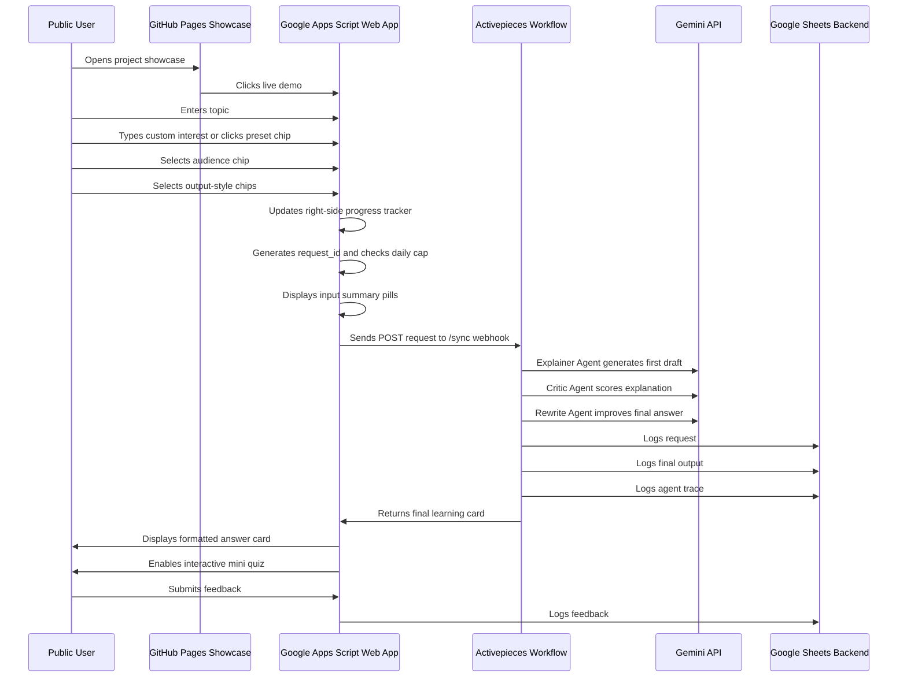
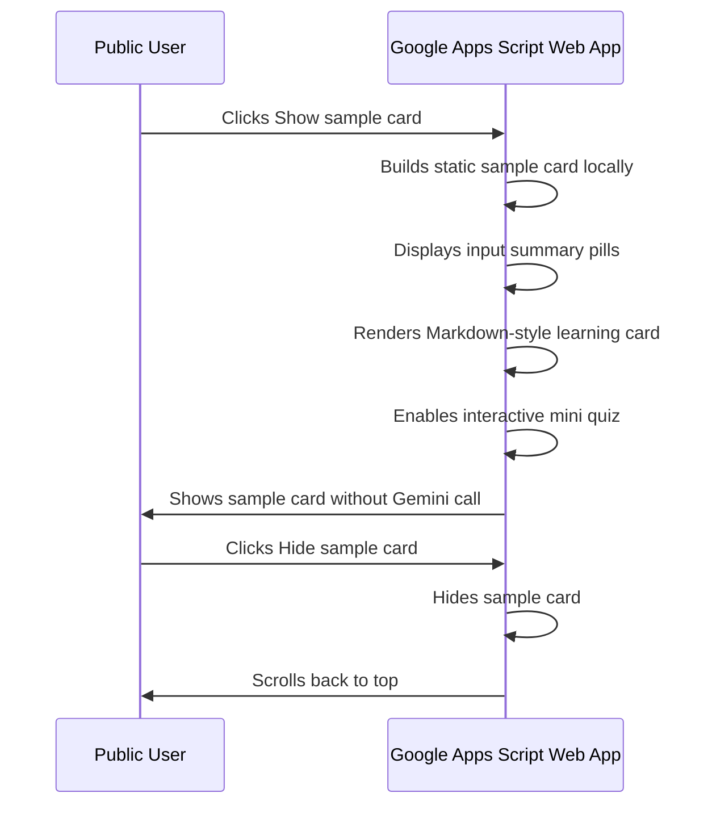
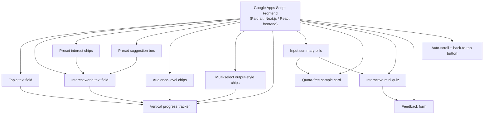
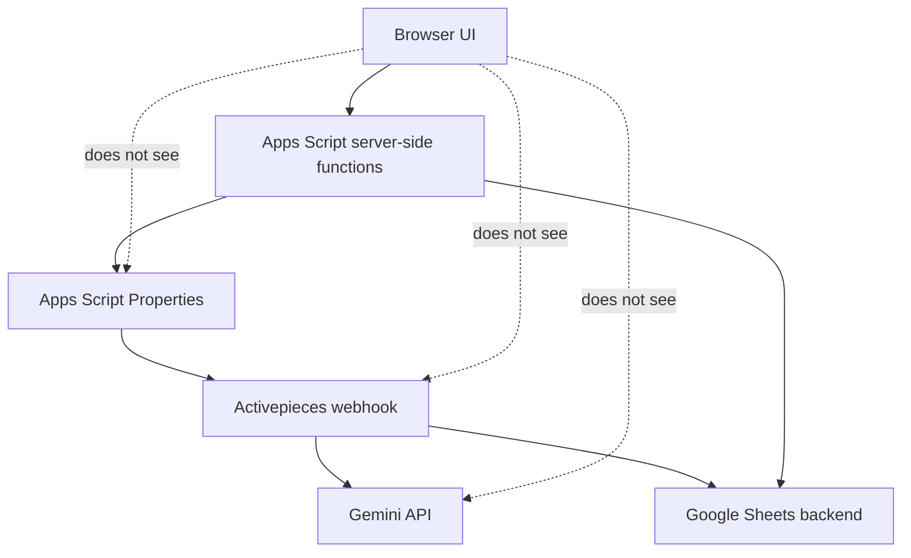

# Analogy Arcade Architecture Diagram

This diagram shows the current Analogy Arcade architecture, the free/browser-based tools used, and paid industry-standard alternatives that could have been used instead.

The current MVP includes:

- Google Apps Script web app
- Activepieces workflow orchestration
- Gemini-powered Explainer, Critic, and Rewrite Agent workflow
- Google Sheets backend
- GitHub Pages showcase
- Custom interest input with preset chips
- Clickable audience chips
- Multi-select output-style chips
- Right-side progress tracker
- Input summary pills
- Interactive mini quiz
- Quota-free sample card
- Floating back-to-top button
- Feedback capture

---

## 1. System Architecture



---

## 2. Runtime Flow



---

## 3. Quota-Free Sample Card Flow



---

## 4. Frontend UX Architecture



---

## 5. Tooling Map

| Layer | Tool used | Paid industry-standard alternatives | Why this choice was used |
|---|---|---|---|
| Public project showcase | GitHub Pages | Vercel Pro, Netlify Pro, Webflow, AWS Amplify | Free, public, connected directly to the repo |
| Source of truth | GitHub repo | GitLab Ultimate, Azure DevOps, Bitbucket, Jira + Confluence | Strong public portfolio artifact |
| Product docs | README + PRD in GitHub | Confluence, Notion, Productboard, Jira Product Discovery | Easy for hiring managers to inspect |
| Live web app | Google Apps Script Web App | Vercel + Next.js, Firebase, AWS Lambda + API Gateway | Browser-only, no local setup, free for MVP |
| Frontend interaction layer | Apps Script HTML / CSS / JavaScript | React, Next.js, Retool, Bubble, Webflow app | Enough for a public MVP without local installs |
| Secret storage | Apps Script Properties | Google Secret Manager, AWS Secrets Manager, HashiCorp Vault | Keeps webhook URL and Sheet ID out of browser code and GitHub |
| Workflow automation | Activepieces | Zapier, Make, Workato, Tray.io, n8n Cloud | Browser-based automation with agent workflow patterns |
| AI model provider | Gemini API free tier | OpenAI API, Anthropic Claude API, Vertex AI, Azure OpenAI | Free-tier model access through Google AI Studio |
| Agent orchestration | Activepieces steps | LangChain, LangGraph, CrewAI, Vertex AI Agent Builder | Visual workflow orchestration without local coding |
| Backend storage | Google Sheets | Airtable, Supabase, PostgreSQL, Firebase Firestore, BigQuery | Free, simple, inspectable data store |
| Feedback capture | Google Sheets Feedback tab | Productboard, Pendo, Amplitude, Airtable | Low-friction MVP feedback loop |
| Output storage | Google Drive / Docs | Notion, Confluence, SharePoint, Box | Fits existing Google One storage ecosystem |
| API testing | Hoppscotch | Postman Team, Insomnia Enterprise | Browser-based API testing with no install |
| Usage protection | Apps Script daily cap | Cloudflare rate limiting, Kong, AWS API Gateway usage plans | Protects free AI quota from accidental overuse |
| Future analytics | Google Sheets / Looker Studio | Amplitude, Mixpanel, Pendo, Heap | Free or low-cost way to show product metrics |

---

## 6. Key Product UX Components

| UX component | Current behavior | Why it matters |
|---|---|---|
| Interest text field | User can type any interest world | Enables true personalization |
| Preset interest chips | User can click presets like football, space, Bollywood, and cooking | Speeds up input and shows product personality |
| Preset suggestion box | Matching preset appears while typing | Helps users discover presets without a dropdown |
| Audience chips | User selects one audience level by clicking | Makes the app feel more playful than a standard form |
| Output-style chips | User can multi-select the desired response sections | Gives users control over answer format |
| Progress tracker | Right-side checkpoints turn green as inputs are completed | Guides the user through the form |
| Input summary pills | Displays “Explain topic in terms of interest like I’m a audience” | Makes output visibly tied to user intent |
| Interactive mini quiz | User selects an answer; answer is revealed after click | Turns passive explanation into active learning |
| Sample card toggle | Shows/hides a quota-free sample card | Lets reviewers preview the product without using AI quota |
| Back-to-top button | Floating button appears after scrolling down | Improves navigation after long generated content |

---

## 7. Design Rationale

Analogy Arcade is intentionally built with free, browser-accessible tools. The architecture prioritizes:

- No local downloads
- No paid hosting
- Public portfolio visibility
- Agentic workflow demonstration
- Simple observability through Google Sheets
- Responsible quota protection
- Easy replacement of model providers later
- Fun, personalized learning experience
- Product-quality UX details despite no-code / low-code constraints

The architecture mirrors real AI product patterns:

```text
User request
→ Generation
→ Evaluation
→ Rewrite
→ Logging
→ Feedback
→ Iteration
```

The frontend also mirrors real product design patterns:

```text
Input guidance
→ Personalization
→ Progress tracking
→ Generated output
→ Interactive learning
→ Feedback capture
```

---

## 8. Current Constraints

The current architecture has a few deliberate constraints:

| Constraint | Impact | Mitigation |
|---|---|---|
| Gemini free-tier quota | Limits public usage volume | Daily request cap |
| Multi-agent flow uses multiple model calls | Each user request consumes several AI calls | Future quota-safe composite mode |
| Google Sheets is not a production database | Not ideal for high-volume usage | Good enough for MVP and portfolio demo |
| Apps Script UI is lightweight | Limited frontend customization | Custom HTML / CSS / JavaScript for richer UX |
| Activepieces flow is visual, not code-first | Harder to version-control full logic | Document workflow and export screenshots / JSON |
| Public demo has no login | Possible usage abuse | Daily cap and public warning |
| Feedback data is simple | Limited analytics depth | Future Looker Studio dashboard |

---

## 9. Current Security Design



Security design decisions:

- Gemini API key is not stored in GitHub.
- Activepieces webhook URL is stored in Apps Script Properties.
- Google Sheet ID is stored in Apps Script Properties.
- Browser JavaScript calls Apps Script server-side functions instead of calling model APIs directly.
- Public repo only includes sanitized source code and documentation.
- Live demo includes a daily request cap.

---

## 10. Future Architecture Options

### Option A: Quota-Safe Public Mode

```text
User
→ Apps Script
→ Activepieces
→ Single composite AI call
→ Google Sheets
→ Response
```

This reduces AI calls per request while keeping the user-visible agent trace.

### Option B: More Production-Like AI App

```text
User
→ Vercel / Next.js
→ API route
→ LangGraph or custom orchestration
→ OpenAI / Anthropic / Vertex AI
→ Supabase / Postgres
→ Analytics
```

This would be more scalable, but it would violate the current zero-spend and browser-only constraint.

### Option C: Open-Weight Hosted Model Path

```text
User
→ Apps Script
→ Activepieces HTTP request
→ Cloudflare Workers AI or Groq
→ Google Sheets
→ Response
```

This could reduce dependence on Gemini quotas while keeping the project mostly browser-based and free-tier friendly.

---

## 11. Security Notes

Do not publish:

- Gemini API key
- Activepieces webhook URL
- Google Sheet edit link
- Google Sheet ID
- Apps Script project ID
- Apps Script script properties
- Raw user data
- Private test payloads
- Personal emails

Publicly safe artifacts:

- Architecture diagram
- PRD
- Prompt templates
- Sanitized source code
- Sanitized screenshots
- Sample outputs
- GitHub Pages showcase
- Live demo link with daily cap
