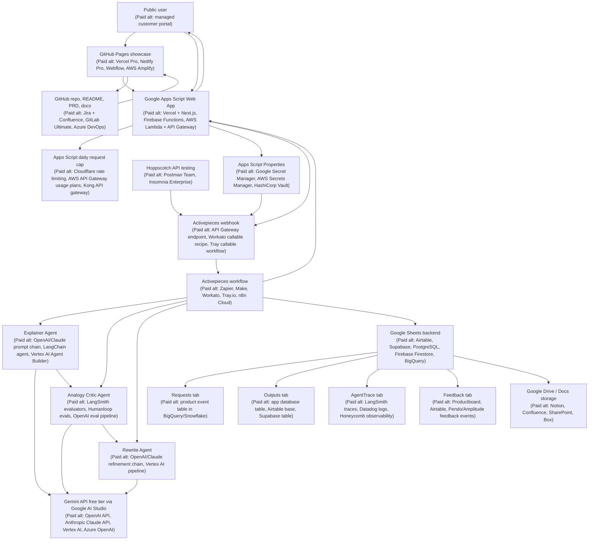
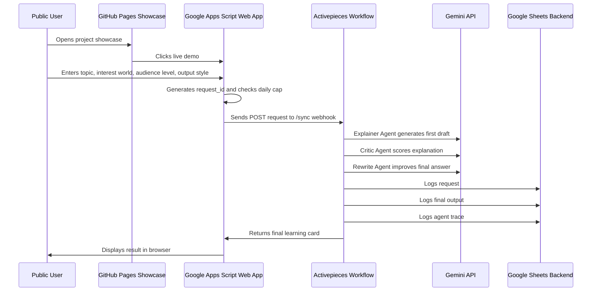

# Analogy Arcade Architecture Diagram

This diagram shows the current Analogy Arcade architecture, the free/browser-based tools used, and paid industry-standard alternatives that could have been used instead.

---

## 1. System Architecture



---

## 2. Runtime Flow



---

## 3. Tooling Map

| Layer | Tool used | Paid industry-standard alternatives | Why this choice was used |
|---|---|---|---|
| Public project showcase | GitHub Pages | Vercel Pro, Netlify Pro, Webflow, AWS Amplify | Free, public, connected directly to the repo |
| Source of truth | GitHub repo | GitLab Ultimate, Azure DevOps, Bitbucket, Jira + Confluence | Strong public portfolio artifact |
| Product docs | README + PRD in GitHub | Confluence, Notion, Productboard, Jira Product Discovery | Easy for hiring managers to inspect |
| Live web app | Google Apps Script Web App | Vercel + Next.js, Firebase, AWS Lambda + API Gateway | Browser-only, no local setup, free for MVP |
| Secret storage | Apps Script Properties | Google Secret Manager, AWS Secrets Manager, HashiCorp Vault | Keeps webhook URL out of browser code and GitHub |
| Workflow automation | Activepieces | Zapier, Make, Workato, Tray.io, n8n Cloud | Browser-based automation with agent workflow patterns |
| AI model provider | Gemini API free tier | OpenAI API, Anthropic Claude API, Vertex AI, Azure OpenAI | Free-tier model access through Google AI Studio |
| Agent orchestration | Activepieces steps | LangChain, LangGraph, CrewAI, Vertex AI Agent Builder | Visual workflow orchestration without local coding |
| Backend storage | Google Sheets | Airtable, Supabase, PostgreSQL, Firebase Firestore, BigQuery | Free, simple, inspectable data store |
| Output storage | Google Drive / Docs | Notion, Confluence, SharePoint, Box | Fits existing Google One storage ecosystem |
| API testing | Hoppscotch | Postman Team, Insomnia Enterprise | Browser-based API testing with no install |
| Usage protection | Apps Script daily cap | Cloudflare rate limiting, Kong, AWS API Gateway usage plans | Protects free AI quota from accidental overuse |
| Future analytics | Google Sheets / Looker Studio | Amplitude, Mixpanel, Pendo, Heap | Free or low-cost way to show product metrics |

---

## 4. Design Rationale

Analogy Arcade is intentionally built with free, browser-accessible tools. The architecture prioritizes:

- No local downloads
- No paid hosting
- Public portfolio visibility
- Agentic workflow demonstration
- Simple observability through Google Sheets
- Responsible quota protection
- Easy replacement of model providers later

The architecture also mirrors real AI product patterns:

```text
User request
→ Generation
→ Evaluation
→ Rewrite
→ Logging
→ Response
```

This separates user value creation, quality control, observability, and launch safety into distinct product concerns.

---

## 5. Current Constraints

The current architecture has a few deliberate constraints:

| Constraint | Impact | Mitigation |
|---|---|---|
| Gemini free-tier quota | Limits public usage volume | Daily request cap |
| Multi-agent flow uses multiple model calls | Each user request consumes several AI calls | Future quota-safe composite mode |
| Google Sheets is not a production database | Not ideal for high-volume usage | Good enough for MVP and portfolio demo |
| Apps Script UI is lightweight | Limited frontend customization | Good for browser-only MVP |
| Activepieces flow is visual, not code-first | Harder to version-control full logic | Document workflow and export screenshots/JSON |

---

## 6. Future Architecture Options

### Option A: Quota-Safe Public Mode

```text
User
→ Apps Script
→ Activepieces
→ Single composite AI call
→ Google Sheets
→ Response
```

This reduces AI calls per request while keeping the user-visible agent trace.

### Option B: More Production-Like AI App

```text
User
→ Vercel / Next.js
→ API route
→ LangGraph or custom orchestration
→ OpenAI / Anthropic / Vertex AI
→ Supabase / Postgres
→ Analytics
```

This would be more scalable, but it would violate the current zero-spend and browser-only constraint.

### Option C: Open-Weight Hosted Model Path

```text
User
→ Apps Script
→ Activepieces HTTP request
→ Cloudflare Workers AI or Groq
→ Google Sheets
→ Response
```

This could reduce dependence on Gemini quotas while keeping the project mostly browser-based and free-tier friendly.

---

## 7. Security Notes

Do not publish:

- Gemini API key
- Activepieces webhook URL
- Google Sheet edit link
- Apps Script project secrets
- Raw user data
- Private test payloads
- Personal emails

Publicly safe artifacts:

- Architecture diagram
- PRD
- Prompt templates
- Sanitized screenshots
- Sample outputs
- GitHub Pages showcase
- Live demo link with daily cap
